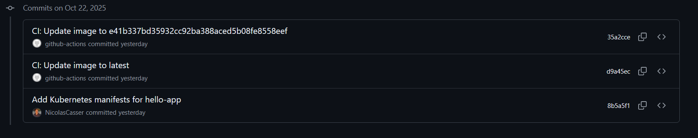
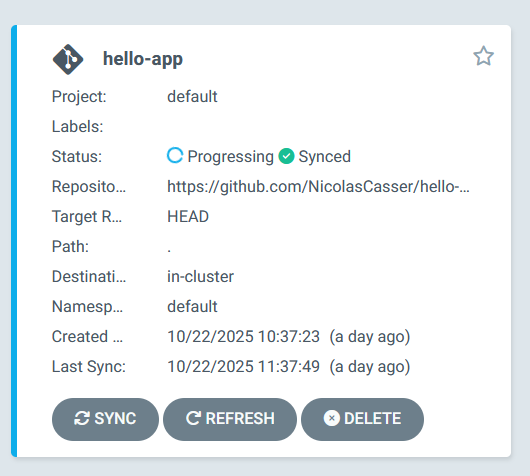
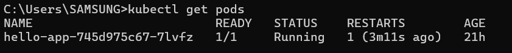
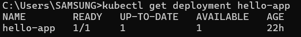
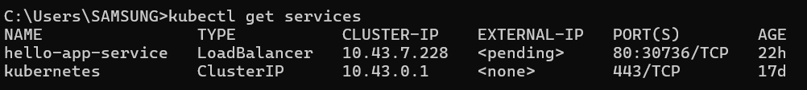

# Repositório de Manifests Kubernetes para GitOps

## 1. Visão Geral do Repositório

Este repositório serve como a **"fonte da verdade"** para a configuração da aplicação hello-app no cluster Kubernetes. Seguindo a metodologia GitOps, todos os manifests Kubernetes são versionados aqui, permitindo rastreabilidade, auditoria e deploy consistente da aplicação.

## 2. Estrutura do Repositório

```
hello-manifests/
├── deployment.yaml    # Configuração do deployment da aplicação
├── service.yaml       # Configuração do service para acesso
└── README.md          # Este documento

```

## 3. Manifests Kubernetes Implementados

### 3.1 Deployment da Aplicação

**Arquivo: deployment.yaml**

```yaml
apiVersion: apps/v1
kind: Deployment
metadata:
  name: hello-app
spec:
  replicas: 1
  selector:
    matchLabels:
      app: hello-app
  template:
    metadata:
      labels:
        app: hello-app
    spec:
      containers:
      - name: hello-app
        image: USUARIO_DOCKER_HUB/hello-app:latest
        ports:
        - containerPort: 8000
        livenessProbe:
          httpGet:
            path: /health
            port: 8000
          initialDelaySeconds: 30
          periodSeconds: 10

```

**Características do Deployment:**

- **Réplicas:** 1 instância da aplicação
- **Imagem:** Atualizada automaticamente pelo pipeline CI/CD
- **Health Checks:** Probe de liveliness configurado no endpoint /health
- **Porta:** 8000 (porta padrão do FastAPI)

### 3.2 Service para Acesso à Aplicação

**Arquivo: service.yaml**

```yaml
apiVersion: v1
kind: Service
metadata:
  name: hello-app-service
spec:
  selector:
    app: hello-app
  ports:
    - protocol: TCP
      port: 80
      targetPort: 8000
  type: LoadBalancer

```

**Características do Service:**

- **Tipo:** LoadBalancer para acesso externo
- **Porta Externa:** 80
- **Porta do Container:** 8000
- **Seletor:** Conecta ao deployment através do label app=hello-app

## 4. Integração com o Fluxo GitOps

### 4.1 Configuração do ArgoCD

O ArgoCD foi configurado para monitorar continuamente este repositório através dos seguintes passos:

**Processo de Configuração:**

1. **Acesso ao ArgoCD:**
    
    ```bash
    kubectl port-forward svc/argocd-server -n argocd 8080:443
    
    ```
    
2. **Obtenção de Credenciais:**
    
    ```bash
    kubectl -n argocd get secret argocd-initial-admin-secret -o jsonpath="{.data.password}" | base64 -d
    
    ```
    
3. **Criação da Aplicação:**
    - **Application Name:** `hello-app`
    - **Project:** `default`
    - **Sync Policy:** `Automated`
    - **Repository URL:** URL deste repositório
    - **Path:** `.` (diretório raiz)
    - **Cluster URL:** `https://kubernetes.default.svc`
    - **Namespace:** `default`

### 4.2 Fluxo de Sincronização Automática

**Quando ocorre uma mudança neste repositório:**

1. ArgoCD detecta automaticamente a modificação
2. Compara o estado atual do cluster com o estado desejado no Git
3. Realiza a sincronização aplicando as mudanças
4. Mantém o cluster consistente com a configuração versionada

### 4.3 Atualização Automática via CI/CD

Este repositório é atualizado automaticamente pelo pipeline CI/CD do repositório `hello-app`:

**Processo de Atualização Automática:**

1. **Build de Nova Imagem:** Pipeline CI/CD constrói nova imagem Docker
2. **Atualização de Tag:** Job update-manifests modifica a tag no deployment.yaml
3. **Commit Automático:** GitHub Actions commita e faz push das alterações
4. **Sincronização:** ArgoCD detecta e implementa as mudanças

**Exemplo de Commit Automático:**

```
CI: Update image to [SHA_DO_COMMIT]
Autor: github-actions

```

## 5. Comandos de Verificação e Operação

### 5.1 Status da Aplicação

```bash
# Verificar recursos Kubernetes
kubectl get deployment hello-app
kubectl get pods -l app=hello-app
kubectl get service hello-app-service

# Verificar logs da aplicação
kubectl logs -l app=hello-app

# Descrever recursos detalhadamente
kubectl describe deployment hello-app

```

### 5.2 Acesso à Aplicação

```bash
# Port-forward para acesso local
kubectl port-forward svc/hello-app-service 8080:80

# Testar aplicação
curl <http://localhost:8080>

# Health check
curl <http://localhost:8080/health>

```

### 5.3 Gerenciamento do ArgoCD

```bash
# Verificar status da aplicação no ArgoCD
argocd app get hello-app

# Forçar sincronização manual
argocd app sync hello-app

# Verificar histórico de deploy
argocd app history hello-app

```

## 6. Evidências de Funcionamento

- **Commits Automáticos do CI/CD**
    
    
    
- **Aplicação Sincronizada no ArgoCD**
    
    
    
- **Recursos Kubernetes Implantados**
    
    
    
    
    

## 7. Benefícios da Abordagem GitOps

- **Versionamento Completo:** Todas as mudanças na configuração são rastreáveis através do histórico do Git
- **Consistência Garantida:** Estado desejado do cluster sempre refletido no repositório
- **Auditoria:** Histórico completo de todas as alterações de configuração
- **Rollback Simples:** Possibilidade de reverter para qualquer versão anterior através do Git
- **Colaboração:** Múltiplos desenvolvedores podem propor mudanças via Pull Requests
- **Segurança:** Controle de acesso granular através das permissões do Git

## 8. Repositório Relacionado

[hello-app](https://github.com/NicolasCasser/hello-app/tree/main) - Contém o código fonte da aplicação FastAPI e o pipeline CI/CD que atualiza automaticamente este repositório.

---
